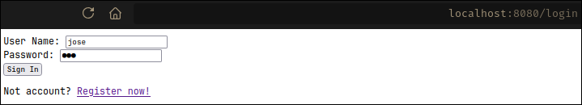
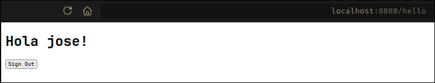
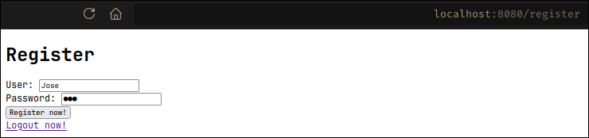
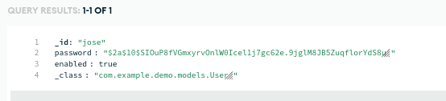
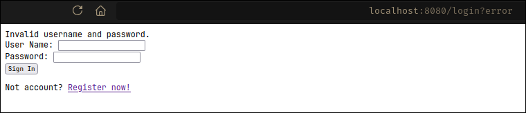

<div align="center">
    <h1 align="center">Spring Security with MongoDB</h1>
    <p align="center">
MVC web application developed with Spring Boot that demonstrates a basic implementation of Spring Security for user authentication.
    </p>
</div>

</br>

## ✨ Features

- User Authentication: Basic login flow implementation.
- Spring Security: Security configuration to protect routes.
- Spring MVC: Model-View-Controller architecture.
- MongoDB Atlas: Integration with a cloud-based NoSQL database.
- Thymeleaf: Server-side template engine for rendering views.

</br>
</br>

## 🛠️ Tech Stack

- Java 17
- Spring Security
- Spring Data MongoDB
- Maven 3.9.X
- MongoDB
- Thymeleaf

</br>
</br>

## 🚀 Getting Started

Follow these steps to set up and run the project in your local environment.

#### Prerequisites

- JDK [Your Java version] or higher installed.
- Maven or Gradle installed.
- A MongoDB Atlas account and a connection string.

#### Setup and Run

- Clone the repository:

```sh
git clone https://github.com/Andr3xDev/ARSW-Auth.git
cd ARSW-Auth
```

- Configure the database connection: Open the src/main/resources/application.properties file and add your MongoDB Atlas connection string:

```Properties
spring.data.mongodb.uri=mongodb+srv://<username>:<password>@<your-cluster>.mongodb.net/<your-database>?retryWrites=true&w=majority
```

Be sure to replace <username>, <password>, <your-cluster>, and <your-database> with your actual credentials.

- Install dependencies and run the app:

```sh
mvn spring-boot:run
```

The application will be available at http://localhost:8080.

### Preview

- Login form:



- Login succesfull:



- Register:



- Database:



- Error:


